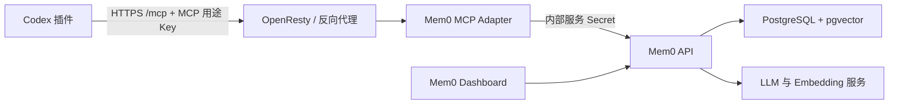

# Mem0 Codex 自托管应用市场

这是一个可直接通过 Git 安装的 Codex 插件市场，也是自托管 Mem0 生产服务的可复现源码入口。仓库固定 Mem0 官方上游提交和生产补丁，收录 MCP Adapter 源码，并把自托管 MCP、生命周期钩子和 16 个记忆技能打包为 `mem0@mem0-self-hosted`。

默认发布配置：

- MCP：`https://mem0-api.jiang.in/mcp`
- 认证环境变量：`MEM0_SELF_HOSTED_API_KEY`
- 插件版本：以 `plugins/mem0/.codex-plugin/plugin.json` 为准

仓库不会保存任何 Mem0 令牌或用户记忆。

## 选择使用方式

| 目标 | 从哪里开始 | 说明 |
| --- | --- | --- |
| 连接当前维护者的实例 | [Codex 插件安装](#codex-插件安装) | 只有在你能够登录该实例并生成 MCP 用途 API Key 时才适用 |
| 部署自己的完整实例 | [完整自托管部署](#完整自托管部署) | 物化固定 Mem0 源码，部署 API、Dashboard、MCP Adapter 和 PostgreSQL，再安装插件 |
| 开发或审查代码 | [本地开发与验证](#本地开发与验证) | 验证插件、生产补丁、MCP 契约和跨平台行为 |

`main` 分支中的插件默认连接维护者公开的 `mem0-api.jiang.in` MCP 入口。其他部署不能共用该实例的 Key；请先完成自己的服务端部署，再 Fork 本仓库并修改 `plugins/mem0/.mcp.json`。生产补丁只包含 `example.com` 示例地址和通用路径，身份、可信代理、网段与外部 Docker 网络必须由部署者显式配置。

## 当前能力

| 层级 | 已提供能力 |
| --- | --- |
| MCP | 11 个工具，覆盖私有项目范围解析、新增、搜索、分页读取、详情、更新、单条删除、历史、实体枚举和两阶段批量管理 |
| 生命周期钩子 | `PreToolUse`、`SessionStart`、`UserPromptSubmit`、`PostToolUse`、`Stop`、`PreCompact` 六类事件 |
| 系统兼容性 | Windows 使用 `python` 与 `commandWindows`，Linux/macOS 使用 `python3`；CI 在三种系统分别验证 |
| 技能 | 16 个自托管技能，覆盖初始化、健康检查、记住、查看、置顶、遗忘、整理、导入导出、项目切换和统计 |
| 项目策略 | 原生解析 `mem0.md` 的 `Settings/Search/Ignore/Identity/Categories/Retention` 六个区段 |
| 自动记忆 | 新仓库跨机器范围自动解析、智能多查询检索、真实 rerank、质量门禁、90 天默认保留、分类保留、压缩后摘要和跨事件去重 |
| 安全 | MCP 专用 Key、固定用户与所有者、强制项目边界、敏感信息脱敏、项目内相对路径、批量删除默认关闭 |

旧版 6 个 MCP 工具保持参数兼容；当前插件和未升级的旧客户端仍可继续使用基础读写能力。

## 与官方 Mem0 插件的关系

本仓库复用了官方插件的交互理念和 SDK 参考资料，但运行时是面向自托管服务的独立实现，不会连接 Mem0 官方云端。

| 对比项 | 官方插件 | 本仓库 |
| --- | --- | --- |
| 服务地址 | Mem0 官方 API/MCP | 固定为仓库配置的自托管 MCP |
| 认证 | `MEM0_API_KEY` 等云端凭据 | 只使用自部署控制台生成且用途为 MCP 的 `MEM0_SELF_HOSTED_API_KEY` |
| 工具数量 | 官方 9 个主要记忆工具 | 官方语义对应工具加历史读取和私有项目范围解析，共 11 个 |
| 身份范围 | 云端账号、用户与应用语义 | 服务端固定用户和所有者，客户端只选择项目或运行范围 |
| 实体目录 | 官方云端实体目录 | 从当前 Adapter 管理的记忆推导项目和运行实体 |
| 搜索与列表 | 由官方云端控制 | 项目查询包含当前项目与全局记忆，精确读取和修改必须匹配项目 |
| 批量删除 | 按官方服务策略执行 | 默认禁用，只允许项目或运行范围的“预览 → 确认令牌 → 执行” |
| 生命周期 | 官方脚本请求云端 API | 本地钩子直接调用同一自托管 MCP，并增加契约漂移检查 |

因此，本仓库已经尽量补齐官方常用能力，但不会模拟官方云端的多租户账号、计费、托管实体目录或后台控制台。

## 完整自托管部署

### 架构



客户端 API Key 只用于 `/auth/introspect` 校验用途和吊销状态。通过校验后，MCP Adapter 使用仅挂载在服务器上的内部服务 Secret 调用 Mem0，客户端 Key 不会被转发到记忆或管理员接口。

### 仓库边界

| 仓库提供 | 必须在服务器另外准备 |
| --- | --- |
| 固定 Mem0 上游提交与经过校验的生产补丁 | 域名、DNS、TLS 证书和反向代理运行环境 |
| Mem0 API、Dashboard 和 Compose 的可重建源码 | LLM、Embedding、PostgreSQL 和 JWT 等 Secret |
| MCP Adapter 的完整源码、锁定依赖和 Dockerfile | `/data/mem0-runtime`、`/data/mem0Mcp` 及正确权限 |
| Codex 插件、技能、钩子和 MCP 契约快照 | PostgreSQL 数据、历史数据库和加密备份 |

Git 仓库用于重建代码，不用于恢复生产数据。要恢复已有记忆，必须同时保留 PostgreSQL 备份；要保持现有登录和内部服务关系，还必须安全保留对应 Secret。

### 1. 准备主机

参考生产拓扑要求：

- Linux 主机，已安装 Git、Python 3.10 或更高版本、OpenSSL、Docker Engine 和 Docker Compose 插件。
- 两个 HTTPS 入口：一个用于 Dashboard，一个用于 API 与精确路径 `/mcp`。
- 能访问选定的 LLM 和 Embedding 服务。
- 参考 Compose 要求连接已经存在的反向代理与模型网关外部 Docker 网络；名称必须由部署者显式配置。
- 镜像支持 `linux/amd64` 与 `linux/arm64`；应在目标架构构建，或使用 Buildx 显式指定平台。

不要在未确认用途时盲目创建与现有基础设施同名的 Docker 网络。先检查实际网络：

```bash
sudo docker network ls
sudo docker network inspect reverse-proxy
sudo docker network inspect model-gateway
```

上面的名称只是示例，在后续配置中通过 `REVERSE_PROXY_NETWORK_NAME` 和 `MODEL_GATEWAY_NETWORK_NAME` 填写实际名称。如果反向代理运行在宿主机，或模型服务直接通过公网访问，应先从物化后的 `server/docker-compose.yaml` 中移除不需要的外部网络并重新审查网络出口，而不是创建没有实际消费者的占位网络。

### 2. 获取并验证源码

```bash
git clone https://github.com/devkitio/mem0-codex-self-hosted-marketplace.git
cd mem0-codex-self-hosted-marketplace
python3 scripts/validate_repo.py
python3 scripts/materialize_mem0.py .mem0-source
```

物化脚本会读取 `services/mem0-server/upstream.json`，获取固定的 Mem0 官方提交，校验 `mem0-production.patch` 的 SHA-256 后应用补丁，并执行 `git diff --check`。目标目录必须尚不存在；重新物化时应使用新的空目录，不要在旧产物上重复应用补丁。

物化后的关键内容：

- `.mem0-source/server/prod.Dockerfile`：Mem0 API 生产镜像。
- `.mem0-source/server/dashboard/Dockerfile`：Dashboard 镜像。
- `.mem0-source/server/docker-compose.yaml`：API、MCP Adapter、Dashboard 与 PostgreSQL 编排。
- `.mem0-source/openresty/`：当前参考部署的反向代理、限流和隐私日志配置。
- `services/mem0-mcp/`：MCP Adapter 的唯一受版本控制源码。

### 3. 准备运行目录

服务器约定 MCP 构建上下文位于 `/data/mem0Mcp`，运行数据位于 `/data/mem0-runtime`：

```bash
sudo install -d -m 0750 /data/mem0Mcp /data/mem0-runtime
sudo install -d -m 0700 -o 10001 -g 10001 /data/mem0Mcp/secrets /data/mem0-runtime/secrets
sudo install -d -m 0700 -o 10001 -g 10001 /data/mem0-runtime/history

sudo install -m 0644 services/mem0-mcp/.dockerignore /data/mem0Mcp/.dockerignore
sudo install -m 0644 services/mem0-mcp/Dockerfile /data/mem0Mcp/Dockerfile
sudo install -m 0644 services/mem0-mcp/requirements.in /data/mem0Mcp/requirements.in
sudo install -m 0644 services/mem0-mcp/requirements.lock /data/mem0Mcp/requirements.lock
sudo install -m 0644 services/mem0-mcp/server.py /data/mem0Mcp/server.py
sudo install -m 0644 services/mem0-mcp/test_adapter.py /data/mem0Mcp/test_adapter.py
```

不要把整个服务器目录复制回 Git。`/data/mem0Mcp/secrets`、`__pycache__`、临时配置和运行日志都不属于源码。

### 4. 生成 Secret 与运行配置

以下五个 Secret 应分别随机生成；三个 MCP Adapter Secret 必须两两不同：

```bash
sudo sh -c 'umask 077; openssl rand -hex 32 > /data/mem0-runtime/secrets/postgres_password'
sudo sh -c 'umask 077; openssl rand -hex 32 > /data/mem0-runtime/secrets/mem0_jwt_secret'
sudo sh -c 'umask 077; openssl rand -hex 32 > /data/mem0Mcp/secrets/mem0_internal_service_key'
sudo sh -c 'umask 077; openssl rand -hex 32 > /data/mem0Mcp/secrets/mcp_confirmation_secret'
sudo sh -c 'umask 077; openssl rand -hex 32 > /data/mem0Mcp/secrets/mcp_project_scope_secret'
sudo chown 10001:10001 /data/mem0-runtime/secrets/* /data/mem0Mcp/secrets/*
sudo chmod 0400 /data/mem0-runtime/secrets/* /data/mem0Mcp/secrets/*
```

`mcp_project_scope_secret` 用于从认证主体与 Git 仓库指纹派生稳定的私有 `project_id`。开始使用跨机器同步后必须长期保留并加密备份；丢失或替换它会让新同步的客户端得到不同范围，旧记忆不会自动迁移。`mcp_confirmation_secret` 可按删除确认策略轮换，但不能复用为项目范围 Secret。

再分别创建以下单行文件，不要加引号，也不要把真实值写进 Git、终端历史、工单或截图：

| 文件 | 内容 |
| --- | --- |
| `/data/mem0-runtime/secrets/llm_api_key` | LLM 服务 API Key |
| `/data/mem0-runtime/secrets/llm_api_base` | OpenAI 兼容 LLM Base URL |
| `/data/mem0-runtime/secrets/embedding_api_key` | Embedding 服务 API Key |
| `/data/mem0-runtime/secrets/embedding_api_base` | OpenAI 兼容 Embedding Base URL |

写入这四个模型配置文件后，同样将所有者设置为 `10001:10001`、权限设置为 `0400`。生产 Compose 会把 Secret 挂载到 `/run/secrets`，不会通过普通环境变量传递。UID `10001` 是 Mem0 API 与 MCP Adapter 镜像中的非 root 运行用户；如果自行修改 Dockerfile 用户，必须同步调整文件所有权。

创建 `/data/mem0-runtime/runtime.env`，只保存非敏感的模型配置，并设置为 `root:root`、权限 `0600`：

```dotenv
LLM_MODEL=gpt-5.4-mini
EMBEDDING_MODEL=qwen3.7-text-embedding
EMBEDDING_DIMS=1024
```

以上模型名称是当前参考格式，必须替换为模型服务实际支持的名称。当前参考配置的 PostgreSQL collection 与 1024 维向量一致。开始写入生产数据后，不要直接修改 Embedding 模型、维度或 collection；这类变更需要单独的数据迁移和重新向量化方案。

### 5. 配置 Compose

参考物化后的 `.mem0-source/server/.env.example` 创建持久化的 `/data/mem0-runtime/compose.env`，并至少检查以下内容：

```dotenv
MEM0_IMAGE=mem0-local/mem0:20260810T120000Z-a81bc3e
MEM0_MCP_IMAGE=mem0-local/mem0-mcp:20260810T120000Z-a81bc3e
MEM0_DASHBOARD_IMAGE=mem0-local/mem0-dashboard:20260810T120000Z-a81bc3e

MEM0_RUNTIME_ROOT=/data/mem0-runtime
MEM0_MCP_ROOT=/data/mem0Mcp
POSTGRES_COLLECTION_NAME=memories_1024

MEM0_INTERNAL_USER_ID=mem0-user
MEM0_INTERNAL_OWNER=mem0-mcp-adapter
MEM0_PUBLIC_API_URL=https://mem0-api.example.com
MEM0_DASHBOARD_URL=https://mem0.example.com
MCP_ALLOWED_HOSTS=mem0-api.example.com,127.0.0.1:*,localhost:*,mem0-mcp:*
MCP_ALLOWED_ORIGINS=https://mem0-api.example.com
MEM0_FORWARDED_ALLOW_IPS=127.0.0.1

MEM0_DATA_SUBNET=172.30.0.0/24
MEM0_DATA_GATEWAY=172.30.0.1
MEM0_DASHBOARD_SUBNET=172.30.1.0/24
MEM0_DASHBOARD_GATEWAY=172.30.1.1
MCP_NETWORK_SUBNET=172.30.2.0/24
MCP_NETWORK_GATEWAY=172.30.2.1
MCP_ENTRY_SUBNET=172.30.3.0/24
MCP_ENTRY_GATEWAY=172.30.3.1

REVERSE_PROXY_NETWORK_NAME=reverse-proxy
MODEL_GATEWAY_NETWORK_NAME=model-gateway
```

上面的域名、身份、网段、网络名和发布标识只是格式示例，必须替换为实际值。`MEM0_INTERNAL_USER_ID` 和 `MEM0_INTERNAL_OWNER` 必须以字母或数字开头，只能包含字母、数字、点、下划线、冒号和连字符，最长 128 个字符；它们与 Embedding 模型、维度和 collection 在写入生产数据后都必须保持稳定。`MEM0_FORWARDED_ALLOW_IPS` 只能包含实际反向代理来源，不能为了方便设置为 `*`。发布标识应包含 Git 提交短 SHA 或 UTC 时间戳；不要使用 `latest`。将 `compose.env` 设置为 `root:root`、权限 `0600`，并在启动前完整检查 `.mem0-source/server/.env.example` 和生成后的 `docker-compose.yaml`。

### 6. 构建镜像

以下示例在目标主机的原生架构构建三个镜像：

```bash
RELEASE_ID="$(date -u +%Y%m%dT%H%M%SZ)-$(git rev-parse --short HEAD)"

sudo docker build --tag "mem0-local/mem0:${RELEASE_ID}" \
  --file .mem0-source/server/prod.Dockerfile .mem0-source

sudo docker build --tag "mem0-local/mem0-mcp:${RELEASE_ID}" \
  /data/mem0Mcp

sudo docker build --tag "mem0-local/mem0-dashboard:${RELEASE_ID}" \
  .mem0-source/server/dashboard
```

构建完成后，把 `compose.env` 中三个镜像的标签更新为命令输出对应的 `RELEASE_ID`。

跨架构构建时使用 Buildx，并把平台替换为实际目标：

```bash
sudo docker buildx build --platform linux/arm64 --load \
  --tag "mem0-local/mem0:${RELEASE_ID}" \
  --file .mem0-source/server/prod.Dockerfile .mem0-source
```

MCP Adapter 与 Dashboard 使用相同方式指定平台。GitHub Actions 会分别验证三个 ARM64 镜像，常规 Linux 验证同时覆盖完整测试与锁定依赖安装。

### 7. 检查并启动

先渲染 Compose，确保没有缺失变量、错误网络或意外公开端口：

```bash
sudo docker compose \
  --env-file /data/mem0-runtime/compose.env \
  --file .mem0-source/server/docker-compose.yaml \
  config
```

确认配置后启动。Mem0 容器会先执行 MCP 范围回填和 Alembic 数据库迁移，再启动 API：

```bash
sudo docker compose \
  --env-file /data/mem0-runtime/compose.env \
  --file .mem0-source/server/docker-compose.yaml \
  up -d --no-build
```

参考 Compose 只把服务绑定到回环地址：Mem0 API `127.0.0.1:8888`、MCP Adapter `127.0.0.1:8890`、Dashboard `127.0.0.1:3111`、PostgreSQL `127.0.0.1:8432`。不要为了省略反向代理而把内部端口直接暴露到公网。

### 8. 配置 HTTPS 反向代理

`.mem0-source/openresty/` 是通用 OpenResty/Nginx 参考配置，包含：

- API、Dashboard 与 MCP 的分流。
- `/internal` 路由阻断。
- MCP 流式响应所需的关闭缓冲配置。
- 登录、API 与 MCP 限流。
- Cloudflare 真实来源地址恢复和不记录正文的隐私日志格式。

这些文件使用 `mem0-api.example.com`、`mem0.example.com`、`/etc/nginx/mem0` 和 `/etc/letsencrypt` 作为示例。复制到服务器前必须替换域名与路径并运行 `nginx -t`；使用 1Panel、Caddy、Traefik 或其他反向代理时，应等价保留 `/mcp` 精确路由、`Authorization` 与 MCP 协议头、关闭响应缓冲、HTTPS 以及 `/internal` 禁止外部访问。

### 9. 验证服务

```bash
sudo docker compose \
  --env-file /data/mem0-runtime/compose.env \
  --file .mem0-source/server/docker-compose.yaml \
  ps

curl --fail http://127.0.0.1:8888/api/readyz
curl --fail http://127.0.0.1:8890/readyz
curl --fail http://127.0.0.1:3111/api/health
curl --fail https://mem0-api.example.com/api/health
```

最后一个地址是示例，验证时必须替换为自己的 API 域名。

还应确认：

- 未携带 Bearer Token 请求公网 `/mcp` 时被拒绝。
- 公网无法访问 `/internal` 与 `/internal/*`。
- Dashboard 能完成管理员初始化并正常登录。
- Dashboard 的 API Key 页面可以分别创建“管理员 REST API”和“Codex MCP（受限）”两种 Key。

在 Dashboard 生成用途为“Codex MCP（受限）”的 Key 后，再继续安装客户端插件。不要把管理员 Key 配置给 Codex。

### 10. 备份、升级与回滚

至少备份以下内容：

- PostgreSQL：记忆、用户、API Key 哈希、MCP 删除操作和业务状态。
- `/data/mem0-runtime/history`：本地历史数据库。
- `/data/mem0-runtime/runtime.env` 与 `compose.env`：运行配置和当前镜像标识。
- `/data/mem0-runtime/secrets` 与 `/data/mem0Mcp/secrets`：使用独立加密介质备份，不得提交 Git。
- 当前 Git 提交、物化清单和三个镜像发布标识。

升级前先执行 PostgreSQL 一致性备份并记录当前镜像标识。首次升级到包含 `resolve_project_scope` 的版本时，必须先按第 4 步创建并备份 `mcp_project_scope_secret`，否则新 Adapter 会拒绝启动。拉取新提交后，在新的空目录重新物化和测试，构建新的不可变镜像；只有验证通过后才更新 `compose.env` 中的三个镜像标识并执行 `docker compose up -d --no-build`。回滚时恢复旧镜像标识；如果新版本已经执行不可逆数据库迁移，还必须按对应版本的数据库方案恢复备份，不能只回滚容器。

仓库不包含生产数据和 Secret，因此只备份 Git 仓库不足以灾难恢复。尤其不能丢失 `mcp_project_scope_secret`，否则无法继续为同一用户和仓库派生原有项目范围。

## Codex 插件安装

### 1. 准备环境

安装 Python 3.10 或更高版本，并确认：

- Windows 可执行 `python --version`
- macOS/Linux 可执行 `python3 --version`

插件运行时只使用 Python 标准库，路径、文件锁、原子状态写入和 UTF-8 数据均兼容 Windows、Linux 与 macOS。项目标识与生产 MCP 保持一致，只允许 1～64 位字母、数字、点、下划线或连字符。没有旧范围的新 Git 仓库会在首次 `SessionStart` 自动获取私有跨机器范围；已有本机范围的旧仓库保持不变并提示迁移确认。两种情况都不会在公开仓库写入 `project_id`。

在自部署 Mem0 控制台生成并保存一个用途为“Codex MCP（受限）”的新 API Key，然后设置为 `MEM0_SELF_HOSTED_API_KEY`。管理员 REST API Key 不能连接 MCP，MCP Key 也不能访问 `/configure`、`/memories`、`/reset` 等管理员接口。Windows PowerShell 可持久写入当前用户环境：

```powershell
[Environment]::SetEnvironmentVariable("MEM0_SELF_HOSTED_API_KEY", "自部署 Mem0 生成的 MCP 用途 API Key", "User")
```

macOS/Linux 可加入 shell 配置：

```bash
export MEM0_SELF_HOSTED_API_KEY="自部署 Mem0 生成的 MCP 用途 API Key"
```

设置后必须完全退出并重新打开 Codex，使新进程能够读取该变量。不要把真实令牌写入仓库、截图或日志。

MCP 只把该 Key 发送到 Mem0 `/auth/introspect` 校验用途和吊销状态，不会把它转发给记忆或配置接口。校验通过后，所有工具操作都改用只挂载在服务器上的内部服务 Secret。

### 2. 添加 Git 市场并安装插件

```bash
codex plugin marketplace add devkitio/mem0-codex-self-hosted-marketplace --ref main
codex plugin add mem0@mem0-self-hosted
```

也可以使用完整 Git URL：

```bash
codex plugin marketplace add https://github.com/devkitio/mem0-codex-self-hosted-marketplace.git --ref main
codex plugin add mem0@mem0-self-hosted
```

### 3. 信任钩子

1. 重启 Codex 并新建一个任务。
2. 打开 `/hooks`。
3. 逐项查看标记为“新建”或“已修改”的 `Mem0 自托管版` 钩子，使用信任操作确认内容。
4. 在插件目录中确认 `Mem0 自托管版` 已启用。

Codex 不会自动信任第三方钩子；插件更新并改变钩子内容后也需要重新审核。未完成审核时，MCP 技能仍可使用，但自动加载和自动总结不会运行。

### 4. 验证连接

在新的 Codex 任务中运行 `$mem0:health`。该检查会核对令牌、11 个工具、生产契约以及最小读写链路，不会输出令牌或完整记忆正文；用户明确要求“深度检查”时，还会只读审查重复、陈旧和低置信度记忆。

## 钩子行为

| 钩子 | 触发时机 | Mem0 行为 |
| --- | --- | --- |
| `PreToolUse` | 读取、编辑或调用 Mem0 工具前 | 按工具语义补齐 `project_id`；为 `add_memory` 补充受控 metadata；保护托管记忆文件，并按文件路径检索历史 |
| `SessionStart` | 启动、恢复或压缩后 | 首次自动解析新仓库的跨机器范围，检索项目目标、决定、待办和偏好；压缩后提取并保存真实 `isCompactSummary` 摘要 |
| `UserPromptSubmit` | 每次提交提示 | 跳过纯确认和忽略项；复杂请求并发执行 2～4 个互补查询并去重 |
| `PostToolUse` | Mem0 或命令工具结束后 | 记录会话统计；检测命令错误并检索历史解决记录 |
| `Stop` | 每轮助手输出结束 | 通过质量门禁后提取长期记忆，并按保留策略设置过期时间 |
| `PreCompact` | 手动或自动压缩前 | 从最近转录保存压缩前总结 |

`SessionStart` 首次启动时还会扫描 `CLAUDE.md`、`AGENTS.md`、`.cursorrules`、`.windsurfrules` 和 `mem0.md`，按标题分块后以 `infer=false` 导入；每个文件最多读取 100 KB，文件超过限制时不会上传，并会按精确标记安全清理此前由插件导入的旧版本。本地 SHA-256 状态会跳过未变化内容，文件更新或删除后只清理远端搜索结果中项目、来源文件、内容哈希和导入格式均精确匹配的旧分块。本地状态中的未确认 ID 不会直接触发删除。导入前会先持久化待完成状态；文件更新时会保留上一份有效版本，直到新分块序号完整覆盖、写入验证和旧分块逐 ID 清理全部成功。查询、写入或清理暂时失败时保留可续跑状态，并在下次启动恢复；不同项目和项目映射的并发更新都会在文件锁内合并，避免互相覆盖。

自动总结读取最近 12 条用户/助手消息，最多处理 50,000 字符，同时记录分支、触达文件和会话内 Mem0 操作计数。写入使用 `messages` 与 `infer=true`，模型生成的正文始终标记为 `assistant`，避免误记为用户观点；metadata 包含 `type`、`confidence`、`session_id`、分支和项目内相对文件路径。写入前会清除常见系统标签并脱敏普通文本及 JSON 中的令牌、密码和认证头；会话状态使用文件锁合并更新，摘要去重键按 `project_id` 隔离，短消息、寒暄和空内容会被跳过，同一项目中 `Stop` 与 `PreCompact` 的相同正文也不会重复保存。

## 本地设置与 `mem0.md`

插件默认启用项目范围自动同步、自动检索和自动保存。设置按“内置默认值 → 项目 `mem0.md` → 本机 `settings.json` → 环境变量”的顺序覆盖，仓库不能覆盖用户的本机选择。本机设置文件位于 `~/.codex/plugin-data/mem0-self-hosted/settings.json`；也可通过 `PLUGIN_DATA` 改变数据目录。安全相关的 `auto_sync_project` 只接受本机设置和环境变量，项目 `mem0.md` 中的同名项会被忽略。

```json
{
  "auto_save": true,
  "auto_search": true,
  "auto_sync_project": true,
  "search_limit": 5,
  "confidence_threshold": 0.25,
  "rerank": true,
  "debug": false,
  "session_retention_days": 90
}
```

对应环境变量为 `MEM0_AUTO_SAVE`、`MEM0_AUTO_SEARCH`、`MEM0_AUTO_SYNC_PROJECT`、`MEM0_SEARCH_LIMIT`、`MEM0_CONFIDENCE_THRESHOLD`、`MEM0_RERANK`、`MEM0_DEBUG` 和 `MEM0_SESSION_RETENTION_DAYS`。通常无需额外配置；只有希望始终使用本机范围时才设置 `MEM0_AUTO_SYNC_PROJECT=false`。`search_limit` 会限制在 1～20，阈值限制在 0～1，保留天数限制在 0～3650；保留天数为 0 时不写入过期时间，非零值按服务端要求写为 `YYYY-MM-DD`。

可用插件脚本初始化或查看本机设置，不需要手工创建 JSON：

```powershell
python plugins\mem0\scripts\mem0_self_hosted.py --init-settings
python plugins\mem0\scripts\mem0_self_hosted.py --show-settings --cwd "D:\你的项目"
python plugins\mem0\scripts\mem0_self_hosted.py --current-project --cwd "D:\你的项目"
python plugins\mem0\scripts\mem0_self_hosted.py --sync-project --cwd "D:\你的项目"
python plugins\mem0\scripts\mem0_self_hosted.py --clear-project --cwd "D:\你的项目"
```

```bash
python3 plugins/mem0/scripts/mem0_self_hosted.py --init-settings
python3 plugins/mem0/scripts/mem0_self_hosted.py --show-settings --cwd "/你的项目"
python3 plugins/mem0/scripts/mem0_self_hosted.py --current-project --cwd "/你的项目"
python3 plugins/mem0/scripts/mem0_self_hosted.py --sync-project --cwd "/你的项目"
python3 plugins/mem0/scripts/mem0_self_hosted.py --clear-project --cwd "/你的项目"
```

项目根目录的 `mem0.md` 可使用六个二级标题。未知标题和字段会被安全忽略，解析失败会回退到默认行为：

```markdown
## Settings
- auto_search: true
- auto_save: true
- search_limit: 5
- confidence_threshold: 0.25
- rerank: true

## Search
- 架构决定和安全边界
- 最近完成事项与回归测试

## Ignore
- node_modules
- 临时生成文件

## Identity
- 本项目是面向 Windows、Linux 和 macOS 的跨平台桌面应用

## Categories
- 决定：长期架构选择
- 经验：可复用的问题解决方法

## Retention
- session_summary: 90d
- compact_summary: 90d
- decision: forever
- exclude: 临时日志
```

`Search` 会补充检索重点，`Ignore` 使用不区分大小写的文本匹配来跳过自动检索，`Identity` 在任务启动时作为当前项目约定注入，`Categories` 指导自动总结分类，`Retention` 可按 `metadata.type` 设置 `90d`、`forever` 等分类保留策略和排除项。旧的 `days`、`retention_days` 与 `retention_session_days` 仍作为会话总结保留期别名。`mem0.md` 仍会按原有 SHA-256 机制作为项目资料导入，因此旧行为保持兼容。

如果 `[features] hooks = false`，生命周期钩子不会运行。`codex_hooks` 仍可兼容，但已经是旧别名；推荐使用 `hooks = true`。

## 技能

插件包含上下文加载、记住、查看、忘记、置顶、整理、导入、导出、项目切换、统计、巡览和健康检查等 16 个技能。运行时固定服务端用户与所有者字段；技能只传受控的项目、运行、metadata 和 filters，不传云端专用的 `user_id`、`agent_id` 或 `app_id`。

常用入口：

| 技能 | 用途 |
| --- | --- |
| `$mem0:health` | 检查连接、令牌、工具契约和真实读写能力 |
| `$mem0:onboard` | 初始化当前项目并可选导入项目资料 |
| `$mem0:remember` | 保存明确的决定、偏好、约定或经验 |
| `$mem0:peek` / `$mem0:tour` | 快速查询或浏览当前项目记忆 |
| `$mem0:pin` / `$mem0:forget` | 置顶关键记忆或在确认后删除单条记忆 |
| `$mem0:memory-reviewer` / `$mem0:dream` | 审查重复、矛盾和陈旧内容并进行整理 |
| `$mem0:switch-project` | 临时切换项目范围、确认旧范围迁移或强制刷新跨机器范围 |

`switch-project` 的普通切换会把工作区映射保存在本机插件数据目录。新克隆首次启动时，客户端自动规范化 Git 远端并只发送 SHA-256 指纹，MCP 使用当前认证用户的稳定 `subject` 与长期 `MCP_PROJECT_SCOPE_SECRET` 派生私有 `project_id`。结果按“连接凭据指纹 + 仓库指纹”隔离写入本机 `server_project_scopes.json`，不保存原始 Key；缓存命中后不重复调用范围解析。同一 Mem0 用户在其他机器克隆同一远端后首次启动即可得到相同范围。客户端 Key 可以轮换，只要仍属于同一用户；新 Key 会重新解析一次，不会复用其他凭据的缓存。

解析优先级为本机显式映射、服务端同步范围、本机自动范围。已有本机范围的旧仓库不会自动切换，`--current-project` 会返回 `migration_required=true`；确认后运行 `--sync-project`，该命令也可强制刷新当前 Key 的缓存。没有 Git 远端时继续使用完整的本机范围；服务暂时不可用时只保留本机读取，并暂停自动导入、会话总结和所有 Mem0 变更工具，避免后续切换服务端范围后形成两套记忆，后续启动会自动重试。需要明确使用可写本机范围时，可设置 `auto_sync_project=false`。`--clear-project` 会清除当前工作区的显式映射和所有凭据下的对应同步缓存，下次启动重新解析。旧范围里的记忆不会自动迁移或删除。

自托管服务现提供 11 个工具：旧 6 个工具保持兼容，并增加 `get_memory_history`、`list_entities`、`resolve_project_scope`、`delete_all_memories` 和 `delete_entities`。同时支持受限 metadata/filters、分页、过期时间和真实 rerank。项目与运行实体从受管记忆推导，不等同于官方云端实体目录；搜索通过一次受限查询同时覆盖当前项目和全局范围，再按分数返回结果。

两个批量工具在插件配置中默认禁用。需要使用时必须由用户明确启用，并遵循“预览 → 明确确认 → 5 分钟 HMAC 令牌执行”的流程；服务端持久化删除进度，同一令牌只恢复未完成操作或返回既有结果，不支持用户级或全局清空。

## 插件更新

```bash
codex plugin marketplace upgrade mem0-self-hosted
codex plugin add mem0@mem0-self-hosted
```

更新后重启 Codex。钩子内容发生变化时，需要在 `/hooks` 中重新审核。

## 插件卸载

```bash
codex plugin remove mem0@mem0-self-hosted
codex plugin marketplace remove mem0-self-hosted
```

卸载插件不会删除自托管服务中已经保存的记忆。

## 使用其他自托管地址

Fork 本仓库并修改 [`plugins/mem0/.mcp.json`](plugins/mem0/.mcp.json) 中的 `url`。生命周期脚本会读取同一个文件，因此不需要再修改钩子代码。远程地址必须使用 HTTPS，只有 `localhost`、`127.0.0.1` 和 `::1` 等回环地址允许 HTTP；认证只会跟随同源重定向。还要同步检查生产 Compose 中的 `MEM0_PUBLIC_API_URL`、`MEM0_DASHBOARD_URL`、`MCP_ALLOWED_HOSTS`、`MCP_ALLOWED_ORIGINS`，以及物化后 OpenResty 配置中的域名和路径。修改后应提升插件版本并更新仓库校验中的预期地址，避免 Codex 继续使用旧缓存或 CI 误报配置漂移。

## 本地开发与验证

```powershell
python scripts/validate_repo.py
python -m unittest discover -s tests -v
codex plugin marketplace add "D:\code\mem0-codex-self-hosted-marketplace"
codex plugin add mem0@mem0-self-hosted
```

```bash
python3 scripts/validate_repo.py
python3 -m unittest discover -s tests -v
codex plugin marketplace add "/path/to/mem0-codex-self-hosted-marketplace"
codex plugin add mem0@mem0-self-hosted
```

真实连通性检查需要先设置 `MEM0_SELF_HOSTED_API_KEY`：

```powershell
python plugins\mem0\scripts\mem0_self_hosted.py --check
```

```bash
python3 plugins/mem0/scripts/mem0_self_hosted.py --check
```

该命令不仅核对 11 个工具，还会把生产 `tools/list` 的参数、必填项、类型、默认值、枚举和四项 `ToolAnnotations` 与仓库快照比较；发现漂移时返回失败，但不会输出令牌或记忆正文。

GitHub Actions 会在 Ubuntu、Windows 和 macOS 上分别执行仓库校验与完整单元测试。

Linux 任务还会安装 `services/mem0-mcp/requirements.lock` 并运行 Adapter 的鉴权、内部接口和真实 ASGI Bearer 链路测试；生产 Adapter 的 Dockerfile 与锁定源码均位于 `services/mem0-mcp`。

当前实现还通过以下验收：

- 仓库结构、市场配置、六类钩子和 16 个技能校验。
- 完整生命周期脚本单元测试，覆盖三系统路径语义、恢复状态机和安全边界。
- 生产 `messages + infer=true`、metadata、到期日和 rerank 探针。
- `update_memory` metadata 合并、置顶取消和单条清理探针。
- 生产 11 工具契约与 `mcp-schema.snapshot.json` 一致性检查。

## 许可证与来源

本仓库采用 Apache-2.0 许可证。SDK 参考材料来源于 Mem0 官方插件，详见 [`NOTICE.md`](NOTICE.md)。
